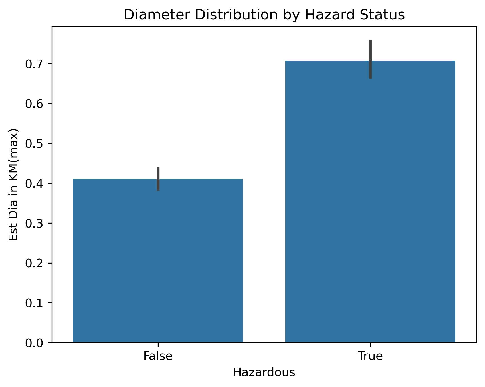

# Nasa_Asteroids_Dataset
## Objective

## About this Dataset
I took this dataset from kaggle. Its about exploring the vast universe with the NASA Asteroids Dataset, a comprehensive collection of information
on Near-Earth Objects (NEOs). These celestial bodies, including asteroids and other space debris, come
close to Earth's orbit, making them subjects of scientific interest and observation.

## Tools used
- SQL
- Python
- Jupyter Notebook

## Methodology
- Data collection and cleaning
- exploratory data analysis
- visualization creation
- Insight generation

## Key Questions Explored
- How many asteroids are classified as hazardous?
- What is the average distance of near earth object?
- What is the average relative velocity of an Asteroid?
- Is there any relation between estimated diameter and an asteroid being hazardous?
- Does the realtive velocity km per hr decreases with the increase in estimated diameter?
- What are the top ten potentially dangerous asteroids?
- Compared the orbital eccentricity/inclination between hazardous and safe asteroids.

## Results
1. How many asteroids are classified as hazardous?
   Answer: The number of safe asteroids is 303.

2. What is the average distance of near earth object?
   Answer:
    Estimated Minimum Diameter in KM =	0.0030517923
    Estimated Maximum Diameter in KM =	9.7732718421

3. What is the average relative velocity of an Asteroid?
   Answer:
     Average relative velocity KM per hr = 50340.474035131185
     Average relative velocity KM per sec = 13.90605221082407

4. Is there any relation between estimated diameter and an asteroid being hazardous?
   Answer:
     Yes, the following plot shows that the higher the number of Estimated diameter results in an asteroid being more hazardous.
   
     
     
           

