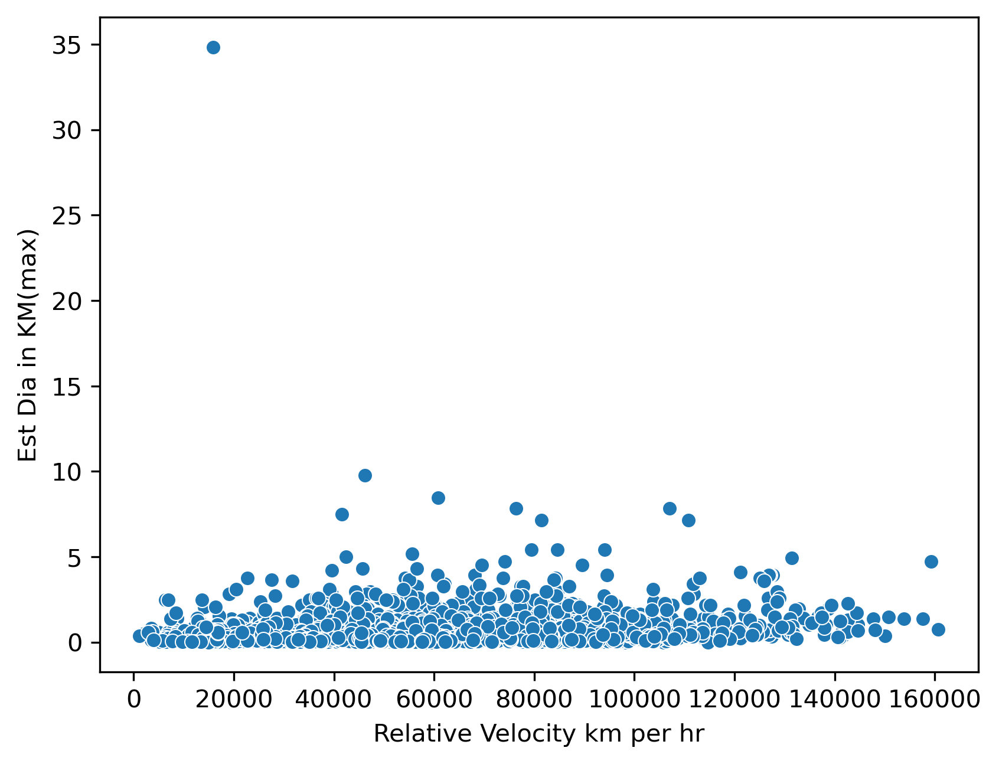
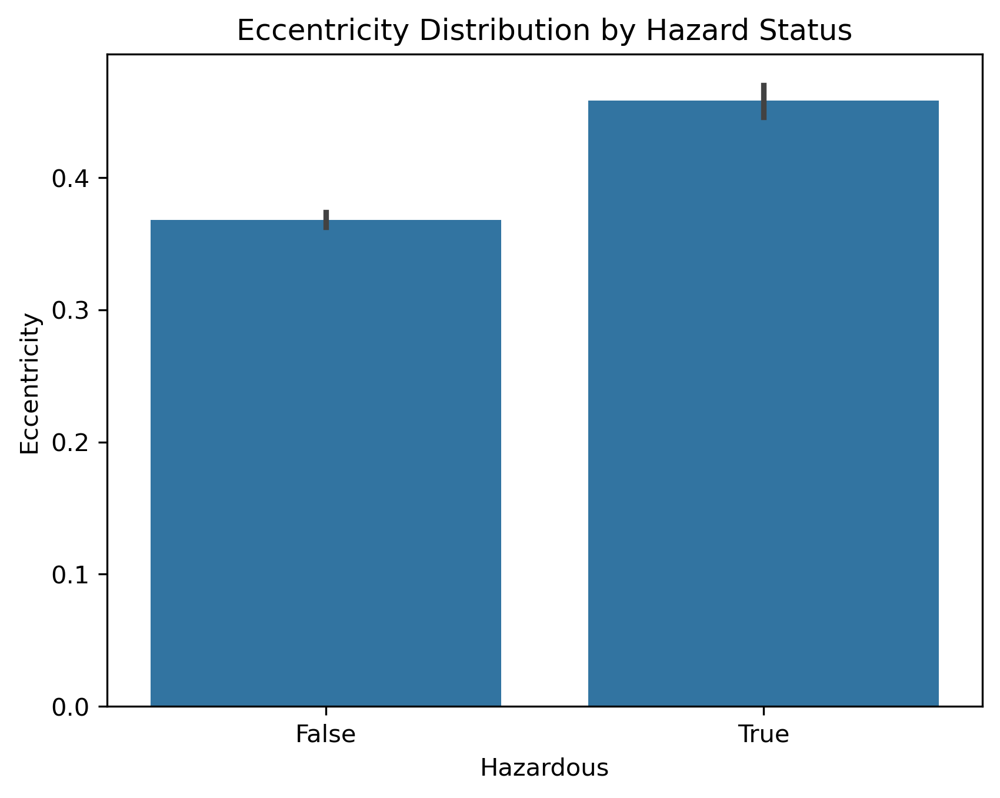

# Nasa_Asteroids_Dataset
## Objective
Identified and analyzed potentially hazardous asteroids using NASA's Near-Earth Object database.
Develop a risk assessment model to prioritize celestial objects based on size, velocity, and proximity to Earth.

## About this Dataset
I took this dataset from kaggle. Its about exploring the vast universe with the NASA Asteroids Dataset, a comprehensive collection of information
on Near-Earth Objects (NEOs). These celestial bodies, including asteroids and other space debris, come
close to Earth's orbit, making them subjects of scientific interest and observation.

## Tools used
- SQL
- Python
- Jupyter Notebook

## Methodology
- Data collection and cleaning
- exploratory data analysis
- visualization creation
- Insight generation

## Key Questions Explored
- How many asteroids are classified as hazardous?
- What is the average distance of near earth object?
- What is the average relative velocity of an Asteroid?
- Is there any relation between estimated diameter and an asteroid being hazardous?
- Does the relative velocity km per hr decreases with the increase in estimated diameter?
- What are the top ten potentially dangerous asteroids?
-  Compared the orbital eccentricity/inclination between hazardous and safe asteroids.

## Results
1. How many asteroids are classified as hazardous?
   Answer: The number of safe asteroids is 303.

   SELECT  COUNT(Hazardous) AS Safe_Asteroids
   FROM nasa_asteroids_data
   WHERE Hazardous = 'TRUE';

3. What is the average distance of near earth object?
   Answer:
    Estimated Minimum Diameter in KM =	0.0030517923
    Estimated Maximum Diameter in KM =	9.7732718421

4. What is the average relative velocity of an Asteroid?
   Answer:
     Average relative velocity KM per hr = 50340.474035131185
     Average relative velocity KM per sec = 13.90605221082407

5. Is there any relation between estimated diameter and an asteroid being hazardous?
   Answer:
     Yes, the following plot shows that the higher the number of Estimated diameter results in an asteroid being more hazardous.
   
     

6. Does the relative velocity km per hr decreases with the increase in estimated diameter?
   Answer:
     Yes, the increase in diameter decreases the relative velocity.

     

7. What are the top ten potentially dangerous asteroids?
   Answer: I determind the top ten potentially dangerous asteroids by using the following equatuon in SQL.

             ( `Est Dia in KM(max)` * `Relative Velocity km per hr` ) / `Miss Dist.(kilometers)`

8. Compared the orbital eccentricity between hazardous and safe asteroids.
   Answer. According to the following bar plot the eccentricity can have an affect on the hazard status of an asteroid.

     

 
           

